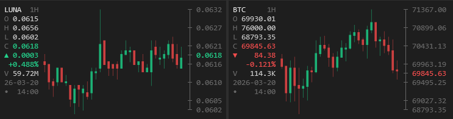

# CandlestickSixel

A C# / .NET 10 CLI tool that renders live cryptocurrency candlestick charts directly in the terminal using [Sixel graphics](https://en.wikipedia.org/wiki/Sixel). Pulls real-time OHLCV data from Binance for Bitcoin (BTC), Ethereum (ETH), and any other supported trading pair — no browser, no Electron, just your terminal.

```
CandlestickSixel BTCUSDT 1h --status=right
```



## Features

- **Sixel rendering** — pixel-accurate candles rendered directly in the terminal (WezTerm, mlterm, foot, iTerm2, Windows Terminal with Sixel enabled)
- **Live crypto data** — fetches OHLCV candles from Binance and auto-refreshes; supports spot pairs like BTCUSDT, ETHUSDT, SOLUSDT and more
- **Intraday day stats** — midnight open, day high/low, cumulative volume shown in the status bar for intraday timeframes
- **Candle selection** — navigate individual candles with arrow keys to inspect O/H/L/C/V
- **Volume bars** — optional volume panel below the chart
- **Y-axis & X-axis labels** — optional price and time labels
- **Flexible status bar** — position at top, bottom, left, or right
- **Timeframe switching** — change interval on the fly without restarting
- **Print mode** — render one frame and exit, useful for scripting or screenshots
- **Terminal resize** — optional startup resize via `-c=`/`--cols` and `-r=`/`--rows`
- **Custom candle colors** — configurable bull/bear colors in hex
- **Pluggable providers** — exchange data source is configurable; Binance is the default

## Requirements

- [.NET 10 SDK](https://dotnet.microsoft.com/download) or later
- A terminal emulator with Sixel support

## Build & Run

```bash
dotnet build -c Release
.\CandlestickSixel BTCUSDT
```

Or run directly without a separate build step:

```bash
dotnet run --project CandlestickSixel.csproj -- BTCUSDT 4h
```

Or download a pre-built binary from [Releases](https://github.com/jota78/CandlestickSixel/releases) (Windows x64, no .NET runtime required).

## Usage

```
CandlestickSixel <SYMBOL> [interval] [options]
CandlestickSixel print <SYMBOL> [interval] [options]
CandlestickSixel help
```

`SYMBOL` is any valid trading pair on the active exchange provider, e.g. `BTCUSDT`, `ETHBTC`, `SOLUSDT`.

### Parameters

| Parameter | Default | Description |
|-----------|---------|-------------|
| `interval` | `15m` | Candlestick timeframe (positional). Valid values: `1m 3m 5m 15m 30m 1h 2h 4h 6h 8h 12h 1d 3d 1w 1M` |
| `-R=` `--refresh=<secs>` | `20` | Data refresh interval in seconds (minimum: 5) |
| `-v` `--enable-volume` | off | Show volume bars below the chart |
| `-y` `--enable-y-axis` | off | Show Y-axis price labels |
| `-x` `--enable-x-axis` | off | Show X-axis time labels |
| `-s=` `--status=<pos>` | `bottom` | Status bar position: `top`\|`t`  `right`\|`r`  `bottom`\|`b`  `left`\|`l` |
| `print` | off | Render one frame and exit (no interactive UI) |
| `-c=` `--cols=<n>` | — | Resize terminal to this column width before starting |
| `-r=` `--rows=<n>` | — | Resize terminal to this row height before starting |
| `-u=` `--bull-color=<hex>` | `#1eb276` | Bull candle color |
| `-d=` `--bear-color=<hex>` | `#cd4141` | Bear candle color |
| `-vu=` `--vol-bull-color=<hex>` | 40% dimmed bull | Volume bull bar color |
| `-vd=` `--vol-bear-color=<hex>` | 40% dimmed bear | Volume bear bar color |

### Examples

```bash
# Bitcoin (BTC/USDT) with defaults (15m)
CandlestickSixel BTCUSDT

# Ethereum (ETH/USDT) — 1h candles, volume bars, Y-axis labels
CandlestickSixel ETHUSDT 1h -v -y

# SOL/USDT — 4h candles, status bar on the right, fixed terminal size
CandlestickSixel SOLUSDT 4h --status=right -c=120 -r=30

# BTC/USDT — daily candles, print one frame and exit
CandlestickSixel print BTCUSDT 1d

# Fast scalping view — 1m candles, refresh every 5s
CandlestickSixel BTCUSDT 1m -R=5

# Custom candle colors
CandlestickSixel BTCUSDT --bull-color=#b967ff --bear-color=#ff6b6b
```

## Interactive Keys

| Key | Action |
|-----|--------|
| `q` / `Ctrl+C` / `Esc` | Quit |
| `F1` | Toggle help overlay |
| `Enter` | Force data refresh |
| `←` / `→` | Select / navigate candles |
| `↑` / `↓` | Cycle timeframe up / down |
| `1` `3` `5` | Switch to 1m / 3m / 5m |
| `0` | Switch to 30m |
| `f` or `g` | Switch to 15m |
| `2` `4` `6` `8` | Switch to 2h / 4h / 6h / 8h |
| `h` | Switch to 1h |
| `d` | Switch to 1d |
| `w` | Switch to 1w |
| `m` | Switch to 1M |
| `v` | Toggle volume bars |
| `y` | Toggle Y-axis labels |
| `x` | Toggle X-axis labels |
| `s` | Cycle status bar position |

## Status Bar

The status bar shows the current day's **O / H / L / C**, price **change** (absolute and percent), and **volume**. When a candle is selected with the arrow keys, the status bar switches to show that candle's individual OHLCV data instead.

The blinking dot indicates fetch state:
- **Green** — idle, data is current
- **Gray** — standby
- **Red** — fetch in progress

## Sixel Support

CandlestickSixel renders crypto candles as pixel-accurate Sixel images inside the terminal cell grid. It probes for Sixel capability at startup — no configuration needed.

Terminals known to support Sixel: **WezTerm**, **mlterm**, **foot**, **iTerm2**, **Contour**, **Windows Terminal** (with Sixel enabled in settings).

